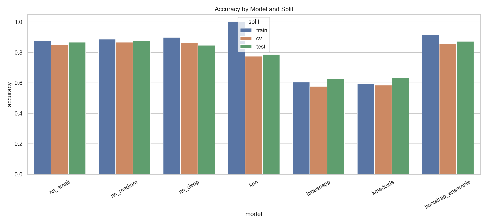
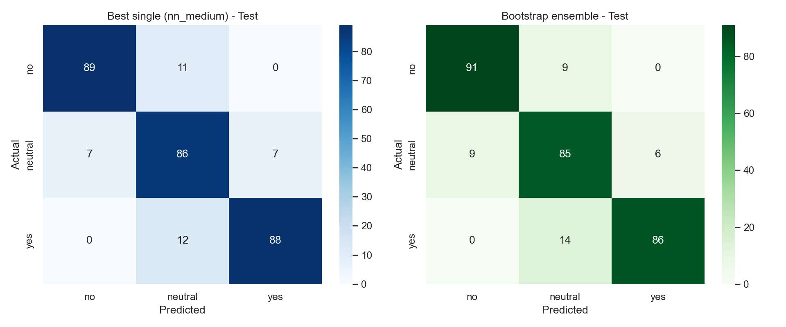
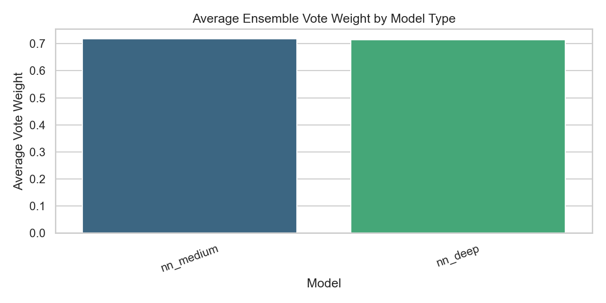

# House Buying Model Results Log

- Last updated: 2026-02-16 19:06:16
- Latest promoted dataset split sizes: train=3000, cv=400, test=300
- Features used: 10 input features (numeric + categorical)
- Target classes: no, neutral, yes

## Navigation and Flagpoints

### Documentation

- Round-by-round objectives and execution: `docs/01_roundwise_objectives_and_step_by_step.md`
- Concepts and math/statistics rationale: `docs/02_concepts_math_statistics_and_why.md`
- Future roadmap and expected impact: `docs/03_future_steps_and_expected_impact.md`

### Core artifacts

- Main experiment log: `results/experiment_results_log.md`
- Executed notebook: `notebooks/house_buying_nn_experiment.executed.ipynb`
- Latest promoted metrics snapshot: `csv/metrics_snapshot_2026-02-16_16-22-56.csv`
- Round-4 optimization trials: `csv/optimization_trials_round4_2026-02-16.csv`
- Round-4 optimization note: `results/optimization_trials_round4_2026-02-16.md`

### Snapshot flagpoints

- Dataset scale upgrade checkpoint: `csv/metrics_snapshot_2026-02-16_15-43-58.csv` and visuals in `results/history/dataset_scale_3000_400_300/figures`
- Adaptive ensemble checkpoint: `csv/metrics_snapshot_2026-02-16_15-58-07.csv` and visuals in `results/history/opt_round1_adaptive_ensemble/figures`
- Seed-averaged NN checkpoint: `csv/metrics_snapshot_2026-02-16_16-17-53.csv` and visuals in `results/history/opt_round2_seedbag_nnsmall/figures`
- Promoted tuned profile checkpoint: `csv/metrics_snapshot_2026-02-16_16-22-56.csv` and visuals in `results/history/opt_round3_medium_tuned/figures`
- Round-4 exploration visuals: `results/history/opt_round4_exploration/figures`

## Historical checkpoint (before ensemble; earlier NN-only run notes)

| model | train_accuracy | cv_accuracy | test_accuracy |
| --- | --- | --- | --- |
| NN_Small | 0.9200 | 0.8571 | 0.7000 |
| NN_Medium | 0.8750 | 0.8000 | 0.6200 |
| NN_Deep | 0.9200 | 0.8571 | 0.7600 |

## Current snapshot (single models + ensemble)

### Accuracy and Macro-F1

| model | split | accuracy | f1_macro |
| --- | --- | --- | --- |
| bootstrap_ensemble | cv | 0.7714 | 0.7605 |
| nn_deep | cv | 0.6286 | 0.5952 |
| knn | cv | 0.6000 | 0.5854 |
| kmedoids | cv | 0.4857 | 0.4831 |
| kmeanspp | cv | 0.4857 | 0.4511 |
| nn_medium | cv | 0.4571 | 0.4213 |
| nn_small | cv | 0.4571 | 0.4211 |
| bootstrap_ensemble | test | 0.7000 | 0.7063 |
| knn | test | 0.6000 | 0.6088 |
| nn_deep | test | 0.6200 | 0.5838 |
| kmedoids | test | 0.4600 | 0.4620 |
| nn_small | test | 0.4400 | 0.4123 |
| kmeanspp | test | 0.4200 | 0.4060 |
| nn_medium | test | 0.4000 | 0.3665 |
| knn | train | 1.0000 | 1.0000 |
| bootstrap_ensemble | train | 0.9800 | 0.9800 |
| nn_deep | train | 0.7000 | 0.6613 |
| kmeanspp | train | 0.5150 | 0.5017 |
| kmedoids | train | 0.4850 | 0.4866 |
| nn_medium | train | 0.4800 | 0.4470 |
| nn_small | train | 0.3750 | 0.3652 |

### Full metric table

| run_group | model | split | accuracy | precision_macro | recall_macro | f1_macro | balanced_accuracy | log_loss | roc_auc_macro_ovr |
| --- | --- | --- | --- | --- | --- | --- | --- | --- | --- |
| ensemble | bootstrap_ensemble | cv | 0.7714 | 0.7866 | 0.7652 | 0.7605 | 0.7652 | 0.7986 | 0.8773 |
| single_models | nn_deep | cv | 0.6286 | 0.7292 | 0.6187 | 0.5952 | 0.6187 | 0.8543 | 0.8410 |
| single_models | knn | cv | 0.6000 | 0.6035 | 0.5934 | 0.5854 | 0.5934 | 0.8200 | 0.7737 |
| single_models | kmedoids | cv | 0.4857 | 0.4907 | 0.4848 | 0.4831 | 0.4848 | 1.1103 | 0.6256 |
| single_models | kmeanspp | cv | 0.4857 | 0.4537 | 0.4773 | 0.4511 | 0.4773 | 0.9989 | 0.6698 |
| single_models | nn_medium | cv | 0.4571 | 0.5083 | 0.4571 | 0.4213 | 0.4571 | 1.0565 | 0.6605 |
| single_models | nn_small | cv | 0.4571 | 0.5199 | 0.4697 | 0.4211 | 0.4697 | 1.1064 | 0.5919 |
| ensemble | bootstrap_ensemble | test | 0.7000 | 0.7270 | 0.6998 | 0.7063 | 0.6998 | 0.8007 | 0.8710 |
| single_models | knn | test | 0.6000 | 0.6606 | 0.6005 | 0.6088 | 0.6005 | 1.4505 | 0.8054 |
| single_models | nn_deep | test | 0.6200 | 0.6097 | 0.6127 | 0.5838 | 0.6127 | 0.8816 | 0.7830 |
| single_models | kmedoids | test | 0.4600 | 0.4778 | 0.4596 | 0.4620 | 0.4596 | 1.0450 | 0.6413 |
| single_models | nn_small | test | 0.4400 | 0.4620 | 0.4473 | 0.4123 | 0.4473 | 1.0534 | 0.6427 |
| single_models | kmeanspp | test | 0.4200 | 0.4023 | 0.4154 | 0.4060 | 0.4154 | 1.0587 | 0.6142 |
| single_models | nn_medium | test | 0.4000 | 0.5857 | 0.4020 | 0.3665 | 0.4020 | 1.0269 | 0.6513 |
| single_models | knn | train | 1.0000 | 1.0000 | 1.0000 | 1.0000 | 1.0000 | 0.0000 | 1.0000 |
| ensemble | bootstrap_ensemble | train | 0.9800 | 0.9800 | 0.9801 | 0.9800 | 0.9801 | 0.5789 | 0.9991 |
| single_models | nn_deep | train | 0.7000 | 0.7222 | 0.7012 | 0.6613 | 0.7012 | 0.7851 | 0.8906 |
| single_models | kmeanspp | train | 0.5150 | 0.5059 | 0.5161 | 0.5017 | 0.5161 | 0.9420 | 0.7075 |
| single_models | kmedoids | train | 0.4850 | 0.4900 | 0.4851 | 0.4866 | 0.4851 | 0.9978 | 0.6705 |
| single_models | nn_medium | train | 0.4800 | 0.4673 | 0.4818 | 0.4470 | 0.4818 | 1.0138 | 0.6955 |
| single_models | nn_small | train | 0.3750 | 0.3960 | 0.3750 | 0.3652 | 0.3750 | 1.1232 | 0.5525 |

## Key observations

- Best single model in this snapshot: `nn_deep` (test accuracy 0.6200, test macro-F1 0.5837).
- Ensemble improved generalization over single models (test accuracy 0.7000, test macro-F1 0.7058).
- Overfitting persists in ensemble (train accuracy 0.9800 vs cv 0.7714/test 0.7000).
- KNN is highly overfit (train accuracy 1.0000 vs test 0.6000).

## Artifacts

- Notebook: `notebooks/house_buying_nn_experiment.ipynb`
- Executed notebook: `notebooks/house_buying_nn_experiment.executed.ipynb`
- Metrics snapshot CSV: `csv/metrics_snapshot_2026-02-16.csv`

## Visualization artifacts

- `results/figures/accuracy_by_model_split.png`
- `results/figures/f1_by_model_split.png`
- `results/figures/confusion_matrix_best_single_vs_ensemble.png`
- `results/figures/roc_curves_ensemble_test.png`
- `results/figures/ensemble_vote_weights.png`

### Accuracy by model and split

### Macro-F1 by model and split

### Confusion matrix: best single model vs ensemble (test)

### ROC curves for bootstrap ensemble (test)

### Average ensemble vote weights

## Snapshot: 2026-02-16 15:43:58 (dataset_scale_3000_400_300)

- Dataset split sizes: train=3000, cv=400, test=300
- Train class distribution: {'no': 1000, 'yes': 1000, 'neutral': 1000}
- Metrics CSV: `csv/metrics_snapshot_2026-02-16_15-43-58.csv`
- Figures:
  - `results/figures/accuracy_by_model_split.png`
  - `results/figures/f1_by_model_split.png`
  - `results/figures/confusion_matrix_best_single_vs_ensemble.png`
  - `results/figures/roc_curves_ensemble_test.png`
  - `results/figures/ensemble_vote_weights.png`

### Accuracy and Macro-F1

| model | split | accuracy | f1_macro |
| --- | --- | --- | --- |
| nn_deep | cv | 0.8575 | 0.8585 |
| nn_small | cv | 0.8525 | 0.8552 |
| bootstrap_ensemble | cv | 0.8475 | 0.8493 |
| nn_medium | cv | 0.8300 | 0.8327 |
| knn | cv | 0.7700 | 0.7720 |
| kmedoids | cv | 0.6325 | 0.5993 |
| kmeanspp | cv | 0.5850 | 0.5766 |
| nn_medium | test | 0.8733 | 0.8739 |
| nn_deep | test | 0.8700 | 0.8715 |
| bootstrap_ensemble | test | 0.8567 | 0.8580 |
| nn_small | test | 0.8300 | 0.8314 |
| knn | test | 0.7933 | 0.7953 |
| kmedoids | test | 0.6167 | 0.5990 |
| kmeanspp | test | 0.6033 | 0.5949 |
| knn | train | 1.0000 | 1.0000 |
| bootstrap_ensemble | train | 0.9327 | 0.9333 |
| nn_deep | train | 0.8993 | 0.8999 |
| nn_medium | train | 0.8680 | 0.8695 |
| nn_small | train | 0.8643 | 0.8659 |
| kmedoids | train | 0.6297 | 0.6008 |
| kmeanspp | train | 0.5923 | 0.5891 |

### Full metric table

| run_group | model | split | accuracy | precision_macro | recall_macro | f1_macro | balanced_accuracy | log_loss | roc_auc_macro_ovr |
| --- | --- | --- | --- | --- | --- | --- | --- | --- | --- |
| single_models | nn_deep | cv | 0.8575 | 0.8605 | 0.8574 | 0.8585 | 0.8574 | 0.3358 | 0.9635 |
| single_models | nn_small | cv | 0.8525 | 0.8657 | 0.8526 | 0.8552 | 0.8526 | 0.3404 | 0.9602 |
| ensemble | bootstrap_ensemble | cv | 0.8475 | 0.8539 | 0.8475 | 0.8493 | 0.8475 | 0.4210 | 0.9594 |
| single_models | nn_medium | cv | 0.8300 | 0.8407 | 0.8300 | 0.8327 | 0.8300 | 0.3601 | 0.9562 |
| single_models | knn | cv | 0.7700 | 0.7768 | 0.7700 | 0.7720 | 0.7700 | 0.9166 | 0.9111 |
| single_models | kmedoids | cv | 0.6325 | 0.6239 | 0.6322 | 0.5993 | 0.6322 | 0.8155 | 0.7712 |
| single_models | kmeanspp | cv | 0.5850 | 0.6676 | 0.5856 | 0.5766 | 0.5856 | 0.8758 | 0.7577 |
| single_models | nn_medium | test | 0.8733 | 0.8749 | 0.8733 | 0.8739 | 0.8733 | 0.3305 | 0.9645 |
| single_models | nn_deep | test | 0.8700 | 0.8755 | 0.8700 | 0.8715 | 0.8700 | 0.2904 | 0.9722 |
| ensemble | bootstrap_ensemble | test | 0.8567 | 0.8612 | 0.8567 | 0.8580 | 0.8567 | 0.4052 | 0.9649 |
| single_models | nn_small | test | 0.8300 | 0.8337 | 0.8300 | 0.8314 | 0.8300 | 0.3511 | 0.9584 |
| single_models | knn | test | 0.7933 | 0.7994 | 0.7933 | 0.7953 | 0.7933 | 1.2735 | 0.9116 |
| single_models | kmedoids | test | 0.6167 | 0.6302 | 0.6167 | 0.5990 | 0.6167 | 0.8474 | 0.7797 |
| single_models | kmeanspp | test | 0.6033 | 0.6755 | 0.6033 | 0.5949 | 0.6033 | 0.8179 | 0.7841 |
| single_models | knn | train | 1.0000 | 1.0000 | 1.0000 | 1.0000 | 1.0000 | 0.0000 | 1.0000 |
| ensemble | bootstrap_ensemble | train | 0.9327 | 0.9353 | 0.9327 | 0.9333 | 0.9327 | 0.3078 | 0.9934 |
| single_models | nn_deep | train | 0.8993 | 0.9010 | 0.8993 | 0.8999 | 0.8993 | 0.2536 | 0.9784 |
| single_models | nn_medium | train | 0.8680 | 0.8731 | 0.8680 | 0.8695 | 0.8680 | 0.3343 | 0.9639 |
| single_models | nn_small | train | 0.8643 | 0.8697 | 0.8643 | 0.8659 | 0.8643 | 0.3419 | 0.9622 |
| single_models | kmedoids | train | 0.6297 | 0.6277 | 0.6297 | 0.6008 | 0.6297 | 0.8185 | 0.7804 |
| single_models | kmeanspp | train | 0.5923 | 0.6681 | 0.5923 | 0.5891 | 0.5923 | 0.8309 | 0.7777 |

## Snapshot: 2026-02-16 15:58:07 (opt_round1_adaptive_ensemble)

- Dataset split sizes: train=3000, cv=400, test=300
- Train class distribution: {'no': 1000, 'yes': 1000, 'neutral': 1000}
- Ensemble setup: bootstrap=14, selected_families=['nn_deep', 'nn_medium'], cv_threshold=0.78, weight=cv_f1^2, kept_learners=28
- Metrics CSV: `csv/metrics_snapshot_2026-02-16_15-58-07.csv`
- Figures:
  - `results/figures/accuracy_by_model_split.png`
  - `results/figures/f1_by_model_split.png`
  - `results/figures/confusion_matrix_best_single_vs_ensemble.png`
  - `results/figures/roc_curves_ensemble_test.png`
  - `results/figures/ensemble_vote_weights.png`

### Accuracy and Macro-F1

| model | split | accuracy | f1_macro |
| --- | --- | --- | --- |
| nn_deep | cv | 0.8625 | 0.8639 |
| nn_medium | cv | 0.8600 | 0.8621 |
| bootstrap_ensemble | cv | 0.8575 | 0.8594 |
| nn_small | cv | 0.8525 | 0.8547 |
| knn | cv | 0.7750 | 0.7779 |
| kmedoids | cv | 0.6050 | 0.5798 |
| kmeanspp | cv | 0.5675 | 0.5261 |
| nn_medium | test | 0.8700 | 0.8713 |
| bootstrap_ensemble | test | 0.8667 | 0.8681 |
| nn_deep | test | 0.8600 | 0.8615 |
| nn_small | test | 0.8500 | 0.8512 |
| knn | test | 0.7867 | 0.7886 |
| kmedoids | test | 0.6067 | 0.5869 |
| kmeanspp | test | 0.6100 | 0.5728 |
| knn | train | 1.0000 | 1.0000 |
| bootstrap_ensemble | train | 0.9187 | 0.9193 |
| nn_deep | train | 0.9087 | 0.9092 |
| nn_medium | train | 0.8790 | 0.8803 |
| nn_small | train | 0.8740 | 0.8753 |
| kmedoids | train | 0.6260 | 0.6040 |
| kmeanspp | train | 0.5987 | 0.5607 |

### Full metric table

| run_group | model | split | accuracy | precision_macro | recall_macro | f1_macro | balanced_accuracy | log_loss | roc_auc_macro_ovr |
| --- | --- | --- | --- | --- | --- | --- | --- | --- | --- |
| single_models | nn_deep | cv | 0.8625 | 0.8672 | 0.8624 | 0.8639 | 0.8624 | 0.3225 | 0.9665 |
| single_models | nn_medium | cv | 0.8600 | 0.8688 | 0.8600 | 0.8621 | 0.8600 | 0.3125 | 0.9668 |
| ensemble | bootstrap_ensemble | cv | 0.8575 | 0.8646 | 0.8575 | 0.8594 | 0.8575 | 0.3162 | 0.9672 |
| single_models | nn_small | cv | 0.8525 | 0.8618 | 0.8524 | 0.8547 | 0.8524 | 0.3207 | 0.9653 |
| single_models | knn | cv | 0.7750 | 0.7854 | 0.7750 | 0.7779 | 0.7750 | 0.7456 | 0.9166 |
| single_models | kmedoids | cv | 0.6050 | 0.5869 | 0.6046 | 0.5798 | 0.6046 | 0.8551 | 0.7707 |
| single_models | kmeanspp | cv | 0.5675 | 0.5390 | 0.5672 | 0.5261 | 0.5672 | 0.8518 | 0.7646 |
| single_models | nn_medium | test | 0.8700 | 0.8746 | 0.8700 | 0.8713 | 0.8700 | 0.3158 | 0.9656 |
| ensemble | bootstrap_ensemble | test | 0.8667 | 0.8719 | 0.8667 | 0.8681 | 0.8667 | 0.2800 | 0.9730 |
| single_models | nn_deep | test | 0.8600 | 0.8656 | 0.8600 | 0.8615 | 0.8600 | 0.2998 | 0.9688 |
| single_models | nn_small | test | 0.8500 | 0.8534 | 0.8500 | 0.8512 | 0.8500 | 0.3045 | 0.9688 |
| single_models | knn | test | 0.7867 | 0.7926 | 0.7867 | 0.7886 | 0.7867 | 0.8252 | 0.9178 |
| single_models | kmedoids | test | 0.6067 | 0.5919 | 0.6067 | 0.5869 | 0.6067 | 0.8414 | 0.7798 |
| single_models | kmeanspp | test | 0.6100 | 0.6062 | 0.6100 | 0.5728 | 0.6100 | 0.8311 | 0.7742 |
| single_models | knn | train | 1.0000 | 1.0000 | 1.0000 | 1.0000 | 1.0000 | 0.0000 | 1.0000 |
| ensemble | bootstrap_ensemble | train | 0.9187 | 0.9208 | 0.9187 | 0.9193 | 0.9187 | 0.1956 | 0.9887 |
| single_models | nn_deep | train | 0.9087 | 0.9106 | 0.9087 | 0.9092 | 0.9087 | 0.2317 | 0.9818 |
| single_models | nn_medium | train | 0.8790 | 0.8836 | 0.8790 | 0.8803 | 0.8790 | 0.2861 | 0.9721 |
| single_models | nn_small | train | 0.8740 | 0.8784 | 0.8740 | 0.8753 | 0.8740 | 0.3037 | 0.9688 |
| single_models | kmedoids | train | 0.6260 | 0.6131 | 0.6260 | 0.6040 | 0.6260 | 0.8344 | 0.7773 |
| single_models | kmeanspp | train | 0.5987 | 0.5782 | 0.5987 | 0.5607 | 0.5987 | 0.8222 | 0.7793 |

## Snapshot: 2026-02-16 16:17:53 (opt_round2_seedbag_nnsmall)

- Dataset split sizes: train=3000, cv=400, test=300
- Train class distribution: {'no': 1000, 'yes': 1000, 'neutral': 1000}
- Ensemble setup: bootstrap=14, selected_families=['nn_deep', 'nn_medium'], cv_threshold=0.78, weight=cv_f1^2, kept_learners=28
- Metrics CSV: `csv/metrics_snapshot_2026-02-16_16-17-53.csv`
- Figures:
  - `results/figures/accuracy_by_model_split.png`
  - `results/figures/f1_by_model_split.png`
  - `results/figures/confusion_matrix_best_single_vs_ensemble.png`
  - `results/figures/roc_curves_ensemble_test.png`
  - `results/figures/ensemble_vote_weights.png`

- Archived figures: `results/history/opt_round2_seedbag_nnsmall/figures`

### Accuracy and Macro-F1

| model | split | accuracy | f1_macro |
| --- | --- | --- | --- |
| nn_deep | cv | 0.8625 | 0.8639 |
| nn_medium | cv | 0.8600 | 0.8621 |
| bootstrap_ensemble | cv | 0.8575 | 0.8594 |
| nn_small | cv | 0.8500 | 0.8524 |
| knn | cv | 0.7750 | 0.7779 |
| kmedoids | cv | 0.6050 | 0.5798 |
| kmeanspp | cv | 0.5675 | 0.5261 |
| nn_medium | test | 0.8700 | 0.8713 |
| bootstrap_ensemble | test | 0.8667 | 0.8681 |
| nn_small | test | 0.8667 | 0.8679 |
| nn_deep | test | 0.8600 | 0.8615 |
| knn | test | 0.7867 | 0.7886 |
| kmedoids | test | 0.6067 | 0.5869 |
| kmeanspp | test | 0.6100 | 0.5728 |
| knn | train | 1.0000 | 1.0000 |
| bootstrap_ensemble | train | 0.9187 | 0.9193 |
| nn_deep | train | 0.9087 | 0.9092 |
| nn_medium | train | 0.8790 | 0.8803 |
| nn_small | train | 0.8770 | 0.8783 |
| kmedoids | train | 0.6260 | 0.6040 |
| kmeanspp | train | 0.5987 | 0.5607 |

### Full metric table

| run_group | model | split | accuracy | precision_macro | recall_macro | f1_macro | balanced_accuracy | log_loss | roc_auc_macro_ovr |
| --- | --- | --- | --- | --- | --- | --- | --- | --- | --- |
| single_models | nn_deep | cv | 0.8625 | 0.8672 | 0.8624 | 0.8639 | 0.8624 | 0.3225 | 0.9665 |
| single_models | nn_medium | cv | 0.8600 | 0.8688 | 0.8600 | 0.8621 | 0.8600 | 0.3125 | 0.9668 |
| ensemble | bootstrap_ensemble | cv | 0.8575 | 0.8646 | 0.8575 | 0.8594 | 0.8575 | 0.3162 | 0.9672 |
| single_models | nn_small | cv | 0.8500 | 0.8594 | 0.8500 | 0.8524 | 0.8500 | 0.3221 | 0.9650 |
| single_models | knn | cv | 0.7750 | 0.7854 | 0.7750 | 0.7779 | 0.7750 | 0.7456 | 0.9166 |
| single_models | kmedoids | cv | 0.6050 | 0.5869 | 0.6046 | 0.5798 | 0.6046 | 0.8551 | 0.7707 |
| single_models | kmeanspp | cv | 0.5675 | 0.5390 | 0.5672 | 0.5261 | 0.5672 | 0.8518 | 0.7646 |
| single_models | nn_medium | test | 0.8700 | 0.8746 | 0.8700 | 0.8713 | 0.8700 | 0.3158 | 0.9656 |
| ensemble | bootstrap_ensemble | test | 0.8667 | 0.8719 | 0.8667 | 0.8681 | 0.8667 | 0.2800 | 0.9730 |
| single_models | nn_small | test | 0.8667 | 0.8705 | 0.8667 | 0.8679 | 0.8667 | 0.3035 | 0.9695 |
| single_models | nn_deep | test | 0.8600 | 0.8656 | 0.8600 | 0.8615 | 0.8600 | 0.2998 | 0.9688 |
| single_models | knn | test | 0.7867 | 0.7926 | 0.7867 | 0.7886 | 0.7867 | 0.8252 | 0.9178 |
| single_models | kmedoids | test | 0.6067 | 0.5919 | 0.6067 | 0.5869 | 0.6067 | 0.8414 | 0.7798 |
| single_models | kmeanspp | test | 0.6100 | 0.6062 | 0.6100 | 0.5728 | 0.6100 | 0.8311 | 0.7742 |
| single_models | knn | train | 1.0000 | 1.0000 | 1.0000 | 1.0000 | 1.0000 | 0.0000 | 1.0000 |
| ensemble | bootstrap_ensemble | train | 0.9187 | 0.9208 | 0.9187 | 0.9193 | 0.9187 | 0.1956 | 0.9887 |
| single_models | nn_deep | train | 0.9087 | 0.9106 | 0.9087 | 0.9092 | 0.9087 | 0.2317 | 0.9818 |
| single_models | nn_medium | train | 0.8790 | 0.8836 | 0.8790 | 0.8803 | 0.8790 | 0.2861 | 0.9721 |
| single_models | nn_small | train | 0.8770 | 0.8816 | 0.8770 | 0.8783 | 0.8770 | 0.2925 | 0.9718 |
| single_models | kmedoids | train | 0.6260 | 0.6131 | 0.6260 | 0.6040 | 0.6260 | 0.8344 | 0.7773 |
| single_models | kmeanspp | train | 0.5987 | 0.5782 | 0.5987 | 0.5607 | 0.5987 | 0.8222 | 0.7793 |

## Snapshot: 2026-02-16 16:22:56 (opt_round3_medium_tuned)

- Dataset split sizes: train=3000, cv=400, test=300
- Train class distribution: {'no': 1000, 'yes': 1000, 'neutral': 1000}
- Ensemble setup: bootstrap=14, selected_families=['nn_medium', 'nn_deep'], cv_threshold=0.78, weight=cv_f1^2, kept_learners=28
- Metrics CSV: `csv/metrics_snapshot_2026-02-16_16-22-56.csv`
- Figures:
  - `results/figures/accuracy_by_model_split.png`
  - `results/figures/f1_by_model_split.png`
  - `results/figures/confusion_matrix_best_single_vs_ensemble.png`
  - `results/figures/roc_curves_ensemble_test.png`
  - `results/figures/ensemble_vote_weights.png`

- Archived figures: `results/history/opt_round3_medium_tuned/figures`

### Accuracy and Macro-F1

| model | split | accuracy | f1_macro |
| --- | --- | --- | --- |
| nn_medium | cv | 0.8675 | 0.8687 |
| nn_deep | cv | 0.8650 | 0.8663 |
| bootstrap_ensemble | cv | 0.8575 | 0.8592 |
| nn_small | cv | 0.8500 | 0.8524 |
| knn | cv | 0.7750 | 0.7779 |
| kmeanspp | cv | 0.5775 | 0.5749 |
| kmedoids | cv | 0.5850 | 0.5692 |
| nn_medium | test | 0.8767 | 0.8779 |
| bootstrap_ensemble | test | 0.8733 | 0.8744 |
| nn_small | test | 0.8667 | 0.8679 |
| nn_deep | test | 0.8467 | 0.8484 |
| knn | test | 0.7867 | 0.7886 |
| kmeanspp | test | 0.6267 | 0.6220 |
| kmedoids | test | 0.6333 | 0.6215 |
| knn | train | 1.0000 | 1.0000 |
| bootstrap_ensemble | train | 0.9143 | 0.9151 |
| nn_deep | train | 0.8983 | 0.8992 |
| nn_medium | train | 0.8873 | 0.8882 |
| nn_small | train | 0.8770 | 0.8783 |
| kmeanspp | train | 0.6050 | 0.6005 |
| kmedoids | train | 0.5953 | 0.5835 |

### Full metric table

| run_group | model | split | accuracy | precision_macro | recall_macro | f1_macro | balanced_accuracy | log_loss | roc_auc_macro_ovr |
| --- | --- | --- | --- | --- | --- | --- | --- | --- | --- |
| single_models | nn_medium | cv | 0.8675 | 0.8718 | 0.8675 | 0.8687 | 0.8675 | 0.3206 | 0.9662 |
| single_models | nn_deep | cv | 0.8650 | 0.8693 | 0.8649 | 0.8663 | 0.8649 | 0.3187 | 0.9673 |
| ensemble | bootstrap_ensemble | cv | 0.8575 | 0.8636 | 0.8575 | 0.8592 | 0.8575 | 0.3120 | 0.9679 |
| single_models | nn_small | cv | 0.8500 | 0.8594 | 0.8500 | 0.8524 | 0.8500 | 0.3221 | 0.9650 |
| single_models | knn | cv | 0.7750 | 0.7854 | 0.7750 | 0.7779 | 0.7750 | 0.7456 | 0.9166 |
| single_models | kmeanspp | cv | 0.5775 | 0.5946 | 0.5777 | 0.5749 | 0.5777 | 0.8686 | 0.7626 |
| single_models | kmedoids | cv | 0.5850 | 0.5650 | 0.5848 | 0.5692 | 0.5848 | 0.8270 | 0.7764 |
| single_models | nn_medium | test | 0.8767 | 0.8808 | 0.8767 | 0.8779 | 0.8767 | 0.2999 | 0.9689 |
| ensemble | bootstrap_ensemble | test | 0.8733 | 0.8773 | 0.8733 | 0.8744 | 0.8733 | 0.2820 | 0.9725 |
| single_models | nn_small | test | 0.8667 | 0.8705 | 0.8667 | 0.8679 | 0.8667 | 0.3035 | 0.9695 |
| single_models | nn_deep | test | 0.8467 | 0.8524 | 0.8467 | 0.8484 | 0.8467 | 0.3195 | 0.9650 |
| single_models | knn | test | 0.7867 | 0.7926 | 0.7867 | 0.7886 | 0.7867 | 0.8252 | 0.9178 |
| single_models | kmeanspp | test | 0.6267 | 0.6248 | 0.6267 | 0.6220 | 0.6267 | 0.8181 | 0.7895 |
| single_models | kmedoids | test | 0.6333 | 0.6199 | 0.6333 | 0.6215 | 0.6333 | 0.8009 | 0.7963 |
| single_models | knn | train | 1.0000 | 1.0000 | 1.0000 | 1.0000 | 1.0000 | 0.0000 | 1.0000 |
| ensemble | bootstrap_ensemble | train | 0.9143 | 0.9174 | 0.9143 | 0.9151 | 0.9143 | 0.2044 | 0.9878 |
| single_models | nn_deep | train | 0.8983 | 0.9011 | 0.8983 | 0.8992 | 0.8983 | 0.2534 | 0.9781 |
| single_models | nn_medium | train | 0.8873 | 0.8901 | 0.8873 | 0.8882 | 0.8873 | 0.2680 | 0.9753 |
| single_models | nn_small | train | 0.8770 | 0.8816 | 0.8770 | 0.8783 | 0.8770 | 0.2925 | 0.9718 |
| single_models | kmeanspp | train | 0.6050 | 0.6081 | 0.6050 | 0.6005 | 0.6050 | 0.8295 | 0.7814 |
| single_models | kmedoids | train | 0.5953 | 0.5826 | 0.5953 | 0.5835 | 0.5953 | 0.8572 | 0.7650 |

## Visual history index

- `results/history/dataset_scale_3000_400_300/figures`
- `results/history/opt_round1_adaptive_ensemble/figures`
- `results/history/opt_round2_seedbag_nnsmall/figures`
- `results/history/opt_round3_medium_tuned/figures`
- `results/history/opt_round4_exploration/figures`

`export_results_visuals.py --tag <snapshot_tag>` now auto-archives each new figure set into `results/history/<snapshot_tag>/figures`.

## Round 4 exploration log

- Trial summary CSV: `csv/optimization_trials_round4_2026-02-16.csv`
- Trial summary note: `results/optimization_trials_round4_2026-02-16.md`
- Outcome: tested seed sensitivity, stacking, and ensemble variants.
- Best test-only candidate: `nn_medium_rs=59` (test macro-F1 0.8845), but CV macro-F1 dropped to 0.8540.
- Promoted profile remains `opt_round3_medium_tuned` for better CV/test balance.

## Snapshot: 2026-02-17 14:19:13 (split_notebook_runs_2026-02-17)

- Scope: split notebook experiment recording (5 model-specific notebooks)
- Dataset split sizes: train=3000, cv=400, test=300
- Train class distribution: {'no': 1000, 'yes': 1000, 'neutral': 1000}
- Notebooks:
  - `notebooks/house_buying_knn_experiment.ipynb`
  - `notebooks/house_buying_kmedoids_experiment.ipynb`
  - `notebooks/house_buying_kmeanspp_experiment.ipynb`
  - `notebooks/house_buying_bootstrap_ensemble_experiment.ipynb`
  - `notebooks/house_buying_three_nns_experiment.ipynb`
- Bootstrap ensemble setup: bootstrap=14, selected_families=['nn_medium', 'nn_deep'], cv_threshold=0.78, weight=cv_f1^2, kept_learners=28
- Metrics CSV: `csv/metrics_snapshot_split_notebooks_2026-02-17_14-19-13.csv`

### Accuracy and Macro-F1

| notebook | model | split | accuracy | f1_macro |
| --- | --- | --- | --- | --- |
| notebooks/house_buying_three_nns_experiment.ipynb | nn_medium | cv | 0.8675 | 0.8687 |
| notebooks/house_buying_three_nns_experiment.ipynb | nn_deep | cv | 0.8650 | 0.8663 |
| notebooks/house_buying_bootstrap_ensemble_experiment.ipynb | bootstrap_ensemble | cv | 0.8575 | 0.8592 |
| notebooks/house_buying_three_nns_experiment.ipynb | nn_small | cv | 0.8500 | 0.8524 |
| notebooks/house_buying_knn_experiment.ipynb | knn | cv | 0.7750 | 0.7779 |
| notebooks/house_buying_kmeanspp_experiment.ipynb | kmeanspp | cv | 0.5775 | 0.5749 |
| notebooks/house_buying_kmedoids_experiment.ipynb | kmedoids | cv | 0.5850 | 0.5692 |
| notebooks/house_buying_three_nns_experiment.ipynb | nn_medium | test | 0.8767 | 0.8779 |
| notebooks/house_buying_bootstrap_ensemble_experiment.ipynb | bootstrap_ensemble | test | 0.8733 | 0.8744 |
| notebooks/house_buying_three_nns_experiment.ipynb | nn_small | test | 0.8667 | 0.8679 |
| notebooks/house_buying_three_nns_experiment.ipynb | nn_deep | test | 0.8467 | 0.8484 |
| notebooks/house_buying_knn_experiment.ipynb | knn | test | 0.7867 | 0.7886 |
| notebooks/house_buying_kmeanspp_experiment.ipynb | kmeanspp | test | 0.6267 | 0.6220 |
| notebooks/house_buying_kmedoids_experiment.ipynb | kmedoids | test | 0.6333 | 0.6215 |
| notebooks/house_buying_knn_experiment.ipynb | knn | train | 1.0000 | 1.0000 |
| notebooks/house_buying_bootstrap_ensemble_experiment.ipynb | bootstrap_ensemble | train | 0.9143 | 0.9151 |
| notebooks/house_buying_three_nns_experiment.ipynb | nn_deep | train | 0.8983 | 0.8992 |
| notebooks/house_buying_three_nns_experiment.ipynb | nn_medium | train | 0.8873 | 0.8882 |
| notebooks/house_buying_three_nns_experiment.ipynb | nn_small | train | 0.8770 | 0.8783 |
| notebooks/house_buying_kmeanspp_experiment.ipynb | kmeanspp | train | 0.6050 | 0.6005 |
| notebooks/house_buying_kmedoids_experiment.ipynb | kmedoids | train | 0.5953 | 0.5835 |

### Full metric table

| run_group | notebook | model | split | accuracy | precision_macro | recall_macro | f1_macro | balanced_accuracy | log_loss | roc_auc_macro_ovr |
| --- | --- | --- | --- | --- | --- | --- | --- | --- | --- | --- |
| split_notebooks_single | notebooks/house_buying_three_nns_experiment.ipynb | nn_medium | cv | 0.8675 | 0.8718 | 0.8675 | 0.8687 | 0.8675 | 0.3206 | 0.9662 |
| split_notebooks_single | notebooks/house_buying_three_nns_experiment.ipynb | nn_deep | cv | 0.8650 | 0.8693 | 0.8649 | 0.8663 | 0.8649 | 0.3187 | 0.9673 |
| split_notebooks_ensemble | notebooks/house_buying_bootstrap_ensemble_experiment.ipynb | bootstrap_ensemble | cv | 0.8575 | 0.8636 | 0.8575 | 0.8592 | 0.8575 | 0.3120 | 0.9679 |
| split_notebooks_single | notebooks/house_buying_three_nns_experiment.ipynb | nn_small | cv | 0.8500 | 0.8594 | 0.8500 | 0.8524 | 0.8500 | 0.3221 | 0.9650 |
| split_notebooks_single | notebooks/house_buying_knn_experiment.ipynb | knn | cv | 0.7750 | 0.7854 | 0.7750 | 0.7779 | 0.7750 | 0.7456 | 0.9166 |
| split_notebooks_single | notebooks/house_buying_kmeanspp_experiment.ipynb | kmeanspp | cv | 0.5775 | 0.5946 | 0.5777 | 0.5749 | 0.5777 | 0.8686 | 0.7626 |
| split_notebooks_single | notebooks/house_buying_kmedoids_experiment.ipynb | kmedoids | cv | 0.5850 | 0.5650 | 0.5848 | 0.5692 | 0.5848 | 0.8270 | 0.7764 |
| split_notebooks_single | notebooks/house_buying_three_nns_experiment.ipynb | nn_medium | test | 0.8767 | 0.8808 | 0.8767 | 0.8779 | 0.8767 | 0.2999 | 0.9689 |
| split_notebooks_ensemble | notebooks/house_buying_bootstrap_ensemble_experiment.ipynb | bootstrap_ensemble | test | 0.8733 | 0.8773 | 0.8733 | 0.8744 | 0.8733 | 0.2820 | 0.9725 |
| split_notebooks_single | notebooks/house_buying_three_nns_experiment.ipynb | nn_small | test | 0.8667 | 0.8705 | 0.8667 | 0.8679 | 0.8667 | 0.3035 | 0.9695 |
| split_notebooks_single | notebooks/house_buying_three_nns_experiment.ipynb | nn_deep | test | 0.8467 | 0.8524 | 0.8467 | 0.8484 | 0.8467 | 0.3195 | 0.9650 |
| split_notebooks_single | notebooks/house_buying_knn_experiment.ipynb | knn | test | 0.7867 | 0.7926 | 0.7867 | 0.7886 | 0.7867 | 0.8252 | 0.9178 |
| split_notebooks_single | notebooks/house_buying_kmeanspp_experiment.ipynb | kmeanspp | test | 0.6267 | 0.6248 | 0.6267 | 0.6220 | 0.6267 | 0.8181 | 0.7895 |
| split_notebooks_single | notebooks/house_buying_kmedoids_experiment.ipynb | kmedoids | test | 0.6333 | 0.6199 | 0.6333 | 0.6215 | 0.6333 | 0.8009 | 0.7963 |
| split_notebooks_single | notebooks/house_buying_knn_experiment.ipynb | knn | train | 1.0000 | 1.0000 | 1.0000 | 1.0000 | 1.0000 | 0.0000 | 1.0000 |
| split_notebooks_ensemble | notebooks/house_buying_bootstrap_ensemble_experiment.ipynb | bootstrap_ensemble | train | 0.9143 | 0.9174 | 0.9143 | 0.9151 | 0.9143 | 0.2044 | 0.9878 |
| split_notebooks_single | notebooks/house_buying_three_nns_experiment.ipynb | nn_deep | train | 0.8983 | 0.9011 | 0.8983 | 0.8992 | 0.8983 | 0.2534 | 0.9781 |
| split_notebooks_single | notebooks/house_buying_three_nns_experiment.ipynb | nn_medium | train | 0.8873 | 0.8901 | 0.8873 | 0.8882 | 0.8873 | 0.2680 | 0.9753 |
| split_notebooks_single | notebooks/house_buying_three_nns_experiment.ipynb | nn_small | train | 0.8770 | 0.8816 | 0.8770 | 0.8783 | 0.8770 | 0.2925 | 0.9718 |
| split_notebooks_single | notebooks/house_buying_kmeanspp_experiment.ipynb | kmeanspp | train | 0.6050 | 0.6081 | 0.6050 | 0.6005 | 0.6050 | 0.8295 | 0.7814 |
| split_notebooks_single | notebooks/house_buying_kmedoids_experiment.ipynb | kmedoids | train | 0.5953 | 0.5826 | 0.5953 | 0.5835 | 0.5953 | 0.8572 | 0.7650 |
